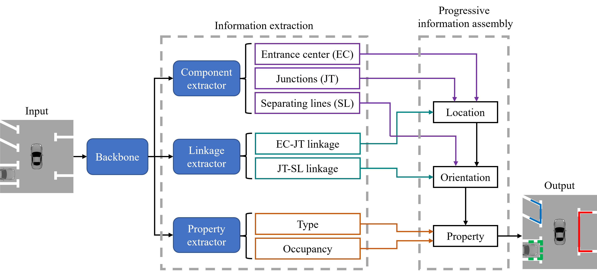
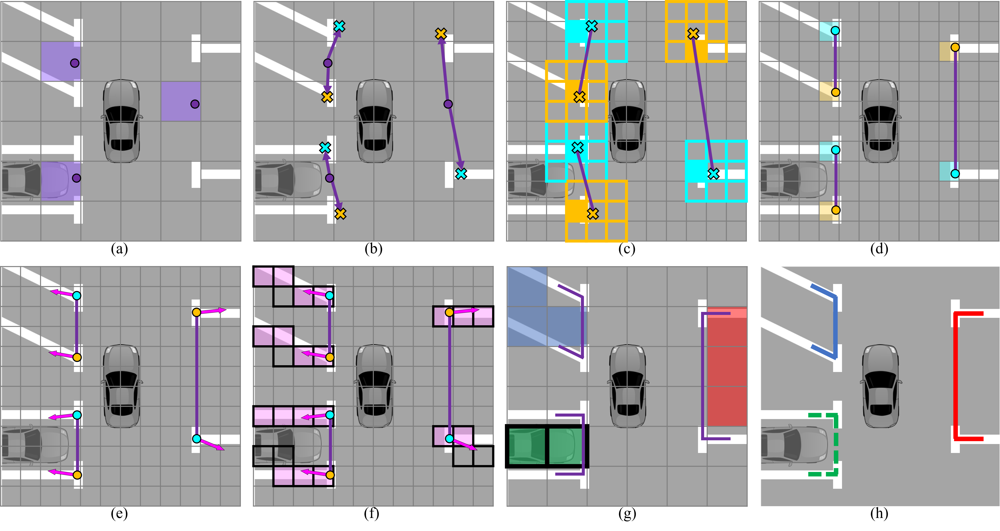

## LinkageNet

By [Quang Huy Bui](https://scholar.google.com/citations?user=Fs_TCCsAAAAJ&hl), [Jae Kyu Suhr](https://scholar.google.com/citations?user=5xKHWZUAAAAJ&hl).

This repository is an offifical implementation of the paper [One-Stage Parking Slot Detection Using Component Linkage and Progressive Assembly](https://ieeexplore.ieee.org/abstract/document/10148652).


## Introduction
**Abstract.** Even though one-stage detectors have advantages for resource-constrained and real-time applications, they face the disadvantage of mediocre performance. Thus, this article proposes a novel one-stage parking slot detection method that achieves comparable performance to two (or multi-)stage detectors. The proposed method extracts the components and properties of the parking slots from input images. As the extracted components and properties are unorganized, it is significantly important to combine them correctly. To this end, this article introduces the component linkages that provide sufficient information for connecting the extracted components and properties. By the guide of the component linkages, the components and properties of the parking slots are progressively assembled to produce precise detection results. In experiments, the proposed method was evaluated using two large-scale parking slot detection datasets and showed state-of-the-art performances. Specifically, in the Seoul National University (SNU) dataset, the proposed method achieved 96.73% recall and 96.75% precision while maintaining a fast processing speed of 134 frames per second. In addition, this article provides a new set of labels for the SNU dataset, which covers more than 60,000 parking slots with high-quality annotations.

<p align='center'>
    
</p>

<p align='center'>
    
</p>


## Citation
If you find LinkageNet useful in your research, please consider citing:
```bibtex
@ARTICLE{10148652,
  author={Bui, Quang Huy and Suhr, Jae Kyu},
  journal={IEEE Intelligent Transportation Systems Magazine}, 
  title={One-Stage Parking Slot Detection Using Component Linkage and Progressive Assembly}, 
  year={2023},
  volume={15},
  number={6},
  pages={33-48},
  keywords={Feature extraction;Couplings;Task analysis;Proposals;Object detection;Deep learning;Resource management;Real-time systems},
  doi={10.1109/MITS.2023.3276592}}
```

## Installation

```bash
pip install -r requirements.txt
```

## Dataset preparation

- [PS2.0](https://cslinzhang.github.io/deepps/)
- [SNU](https://github.com/dohoseok/context-based-parking-slot-detect/) (for SNU dataset, download the new refined label here: [link](https://drive.google.com/file/d/1LmO-BmO7n50aWWHxdfHcZWISj8wXYNLw/view))
